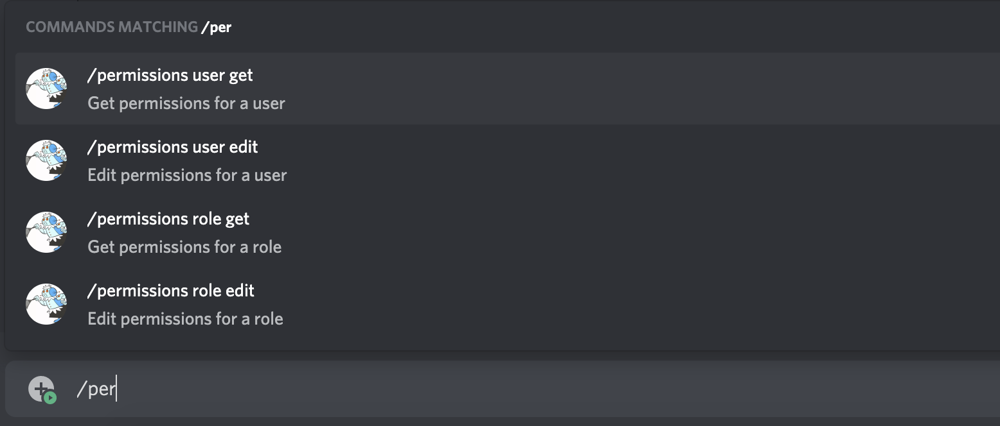

# Adding options

**Table of contents**
1. [Introduction](#introduction)
2. [Basic options](#basic-options)
    1. [Example](#example)
3. [Checking existence](#checking-existence)
    1. [Example](#example-1)
4. [Subcommands](#subcommands)
    1. [Example](#example-2)
5. [Subcommand Groups](#subcommand-groups)
    1. [Example](#example-3)
6. [What's next?](#whats-next)

## Introduction
Adding options to a command is incredibly easy with Slasher. This guide will briefly describe the `commands.json` data needed, but this guide will mostly focus on the code.

For an in-depth explanation of how to define options in a command, check out the [command.json guide](./command-json.md) first.

## Basic options
For any options, you will need to use the `ctx.options` property on the [CommandCreate](../api/SlasherEvents.md#commandcreate) event. This property is an instance of [CommandOptions](../api/CommandOptions.md), so you can refer to that page for an in-depth reference.

But in summary, these are the most common methods you'll use:
|Method|Return Type|Description|
|------|-----------|-----------|
|`has(name)`|boolean|Determines if the given option has been set|
|`getString(name, ?required)`|?string|Gets a string option|
|`getInteger(name, ?required)`|?number|Gets an integer option|
|`getNumber(name, ?required)`|?number|Gets a double number option|
|`getBoolean(name, ?required)`|?boolean|Gets a boolean option|
|`getUser(name, ?required)`|[?User](https://discord.js.org/#/docs/main/stable/class/User)|Gets a user option|
|`getMember(name)`|[?GuildMember](https://discord.js.org/#/docs/discord.js/main/class/GuildMember)|Gets a member option in a server|
|`getMessage(name, ?required)`|[?Message](https://discord.js.org/#/docs/discord.js/main/class/Message)|Gets a message option in a channel|
|`getAttachment(name, ?required)`|[?Attachment](https://discord.js.org/#/docs/discord.js/main/class/Attachment)|Gets an attachment option|
|`getChannel(name, ?required)`|[?GuildChannel](https://discord.js.org/#/docs/main/stable/class/GuildChannel)|Gets a channel option|
|`getRole(name, ?required)`|[?Role](https://discord.js.org/#/docs/main/stable/class/Role)|Gets a role option|
|`getMentionable(name, ?required)`|[?User](https://discord.js.org/#/docs/main/stable/class/User) or [?GuildMember](https://discord.js.org/#/docs/main/stable/class/GuildMember) or [?Role](https://discord.js.org/#/docs/main/stable/class/Role)|Gets a mentionable option|
|`getSubcommand(?required)`|?string|The name of the subcommand which was run|
|`getSubcommandGroup(?required)`|?string|The name of the subcommand group which was run|

The return value of each function may be `null` if the option has not been set or is not present.

The parameters of the functions work as follows:
|Name|Type|Required|Description|
|----|----|--------|-----------|
|name|string|yes|The name of the option to retrieve. This is the same name which is the key of the option object in `commands.json`.|
|required|boolean|no|Whether this option is required or not. Keep in mind that marking the option as required in `commands.json` will force the user to enter a value for it. Setting this parameter to `true` will just throw an error if it is not present.|

### Example
**commands.json**
```json
{
    "$schema": "https://raw.githubusercontent.com/Romejanic/slasher/master/schema.json",

    "greet": {
        "description": "Greet someone!",
        "options": {
            "target": {
                "description": "Who to greet",
                "type": "user"
            }
        }
    }
}
```
**Code**
```js
client.on(SlasherEvents.CommandCreate, (ctx) => {
    if(ctx.name === "greet") {
        // gets user, falls back on sender if no target is set
        let user = ctx.options.getUser("target") || ctx.user;

        // user.toString() creates a mention
        ctx.reply("Hello there " + user.toString() + "! :D");
    }
});
```

## Checking existence
In some cases, you will want to take a different action depending on whether an option is set, whether that's altering your bots behaviour, or even just sending an error message stating that the option is required. For that you can use the `ctx.options.has()` method to determine if an option has been set or not.

### Example
**commands.json**
```json
{
    "$schema": "https://raw.githubusercontent.com/Romejanic/slasher/master/schema.json",

    "search": {
        "description": "Searches the database for a keyword",
        "options": {
            "query": {
                "description": "What to search for",
                "type": "string",
                "required": true
            },
            "page": {
                "description": "The page number to show",
                "type": "integer"
            }
        }
    }
}
```
**Code**
```js
client.on(SlasherEvents.CommandCreate, (ctx) => {
    if(ctx.name === "search") {
        // get the search query
        let query  = ctx.options.getString("query", true);
        let pageNo = 0;

        // check if there is a page number
        if(ctx.options.has("page")) {
            pageNo = ctx.options.getInteger("page");
        }

        // pass to the api
        searchApi.search(query, pageNo);
        ...
    }
});
```

## Subcommands
You can simply use the `ctx.options.getSubcommand()` method to determine which subcommand was sent, and act accordingly depending on its result.

### Example
**commands.json**
```json
{
    "$schema": "https://raw.githubusercontent.com/Romejanic/slasher/master/schema.json",

    "greet": {
        "description": "Greet someone!",
        "options": {
            "yourself": {
                "description": "Greet yourself",
                "subcommand": true
            },
            "other": {
                "description": "Greets another user",
                "options": {
                    "target": {
                        "description": "Who to greet",
                        "type": "user"
                    }
                }
            }
        }
    }
}
```
**Code**
```js
client.on(SlasherEvents.CommandCreate, (ctx) => {
    if(ctx.name === "greet") {
        let user = null;

        switch(ctx.options.getSubcommand()) {
            case "yourself":
                user = ctx.user;
                break;
            case "other":
                user = ctx.options.getUser("target");
                break;
            default:
                break;
        }

        // user.toString() creates a mention
        if(user) ctx.reply("Hello there " + user.toString() + "! :D");
        else ctx.reply("There's nobody to greet :(");
    }
});
```

## Subcommand Groups
Subcommand groups work the exact same way. This can result in some really efficient code organisation by acting on different targets based on which subcommand group was used.

### Example
Taking the [/permissions example](https://discord.com/developers/docs/interactions/application-commands#subcommands-and-subcommand-groups) from Discord:


**commands.json**
```json
{
    "$schema": "https://raw.githubusercontent.com/Romejanic/slasher/master/schema.json",

    "permissions": {
        "description": "Base permission command",
        "options": {
            "user": {
                "description": "User permissions",
                "subcommands": {
                    "get": {
                        "description": "Gets permissions for a user",
                        "options": {
                            "user": {
                                "description": "The user to target",
                                "type": "user"
                            }
                        }
                    },
                    "edit": {
                        "description": "Edits permissions for a user",
                        "options": {
                            "user": {
                                "description": "The user to target",
                                "type": "user"
                            }
                        }
                    }
                }
            },
            "role": {
                "description": "Role permissions",
                "subcommands": {
                    "get": {
                        "description": "Gets permissions for a role",
                        "options": {
                            "role": {
                                "description": "The role to target",
                                "type": "role"
                            }
                        }
                    },
                    "edit": {
                        "description": "Edits permissions for a role",
                        "options": {
                            "role": {
                                "description": "The role to target",
                                "type": "role"
                            }
                        }
                    }
                }
            }
        }
    }
}
```
**Code**
```js
client.on(SlasherEvents.CommandCreate, (ctx) => {
    if(ctx.name === "permissions") {
        let group = ctx.options.getSubcommandGroup();
        switch(ctx.options.getSubcommand()) {
            case "get":
                if(group === "user") {
                    // get a user's permissions
                } else if(group === "role") {
                    // get a role's permissions
                }
                break;
            case "edit":
                if(group === "user") {
                    // edit a user's permissions
                } else if(group === "role") {
                    // edit a role's permissions
                }
                break;
            default:
                break;
        }
    }
});
```

## What's next?
- View the full [commands.json guide](./command-json.md)