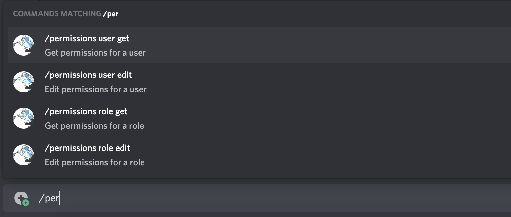

# command.json format

**Table of Contents**
1. [Schema](#schema)
2. [Basic Commands](#basic-commands)
3. [Commands with options](#commands-with-options)
    1. [Types](#types)
    2. [Required Options](#required-options)
    3. [Choices](#choices)
    4. [Channel Types](#channel-types)
4. [Subcommands](#subcommands)
5. [Subcommand Groups](#subcommand-groups)
6. [What's next?](#whats-next)

## Schema
For all `commands.json` files, you should include a `$schema` property to provide auto-complete and suggestions for your file, which will greatly improve your productivity and reduce your proneness to errors.

```json
{
    "$schema": "https://raw.githubusercontent.com/Romejanic/slasher/master/schema.json"
}
```

The examples in this file will not include the `$schema` property, but you should keep in mind that it should always be present above your command definitions.

## Basic Commands
Adding a basic command is dead simple. All you need is to provide a description for the command.
```json
{
    "command": {
        "description": "A brief, concise description of the command"
    }
}
```

This will result in a command like `/command`, with no additional arguments.

## Commands with options
Commands can also have up to 25 options. These are defined in the `options` property of your command. The order of the options in Discord is the same as they are defined in the file.

```json
{
    "command": {
        "description": "A brief, concise description of the command",
        "options": {
            "param": {
                "description": "A regular option",
                "type": "string"
            }
        }
    }
}
```

### Types
When you create an option, you must provide a `description` (same as commands). You must also provide a `type` (unless you have `choices` or `channel_types` defined).

Valid types are: `string`, `integer`, `number`, `boolean`, `user`, `channel`, `role` or `mentionable`.

|Type|Description|
|----|-----------|
|string|A string of text|
|integer|An integer value, only whole numbers can be entered|
|number|An double number value, numbers with decimals can be entered|
|boolean|A single true or false value|
|user|Allows them to select a user to act on|
|channel|Allows them to select a channel to act on|
|role|Allows them to select a role to act on|
|mentionable|Allows you to select a mentionable target (i.e. user or role)|

### Required Options
You can also mark an option as `required`, which means it is mandatory for the user to include these options, and Discord will not allow the user to send the command unless they include them.

```json
{
    "command": {
        "description": "A brief, concise description of the command",
        "options": {
            "param": {
                "description": "A regular option which is required",
                "type": "string",
                "required": true
            }
        }
    }
}
```

### Choices
You can also predefine a list of choices which the user can select from, similar in functionality to an enum. The only two valid types for these choices are `string` and `number`.

Please note that including choices will *force the user* to choose one of them, and will not allow arbitrary input. Keep this in mind when designing your command tree.

Choices are defined in the command tree with the `choices` property in the option. The type of the option will also be automatically inferred from the choices, so you don't need the `type` property.

```json
{
    "command": {
        "description": "A brief, concise description of the command",
        "options": {
            "param": {
                "description": "A regular option with choices",
                "choices": {
                    "Choice A": "choice_a",
                    "Choice B": "choice_b",
                    "Choice C": "random_value"
                }
            }
        }
    }
}
```

Choices are defined as a key-value pair. The key will be a human-readable display name which should be formatted nicely. The value will be the actual value which can be read in your code.

```jsonc
// example of number values
"choices": {
    "Choice A": 25,
    "Choice B": 50,
    "Choice C": 100.2
}
```

### Channel Types
When selecting channels with `type: channel`, by default the user can select any channel they have access to (within a server), which may lead to undesired/unsupported channel types being chosen. Therefore you can optionally specify a limited set of channel types which the user can choose from, and Discord will automatically filter out any other channels.

This greatly improves the user experience, as you can allow Discord to do input validation on channel types, rather than writing code to check it yourself and potentially introducing bugs.

Currently, there are 11 valid channel types defined in the schema: `text`, `dm`, `voice`, `group_dm`, `category`, `announcements`, `store`, `announcement_thread`, `public_thread`, `private_thread` and `stage`.

|Type|Description|
|----|-----------|
|text|A text channel within a server|
|dm|A direct message channel with a user|
|voice|A voice channel within a server|
|group_dm|A direct message channel with multiple users|
|category|A category channel containing many channels|
|announcements|An announcement channel on a server which can be followed|
|store|A channel for game developers to sell their games|
|announcement_thread|A thread channel created from an announcement channel|
|public_thread|A public thread channel created from a text channel|
|private_thread|A private thread channel created from a text channel|
|stage|A stage voice channel with speakers and an audience|

Similar to [choices](#choices), you also do not need to specify the option `type` property, as Slasher will automatically infer that the option is a `channel`.

```json
{
    "lock": {
        "description": "Locks a text channel for 1 minute",
        "options": {
            "channel": {
                "description": "The channel to lock",
                "channel_types": [
                    "text", "public_thread", "private_thread"
                ],
                "required": true
            }
        }
    }
}
```

## Subcommands
Commands can also have subcommands as an option, which on Discord's end will esssentially act like an extra command which is nested within the original command.

However, from a code standpoint, it will still run with the original command's name and context, and you must determine which subcommand was run based on the options.

Subcommands are defined like so:
```json
{
    "command": {
        "description": "A brief, concise description of the command",
        "options": {
            "sub": {
                "description": "A subcommand within the command",
                "subcommand": true
            }
        }
    }
}
```

This results in the `/command sub` command being added to Discord. As usual, subcommands require a `description` property. In order to mark it as a subcommand, you must either include the `subcommand: true` property, or an `options` property.

Following up on that, subcommands can also include options like normal commands. Pretty much the same rules about normal command options apply [as above](#commands-with-options).

```json
{
    "command": {
        "description": "A brief, concise description of the command",
        "options": {
            "sub": {
                "description": "A subcommand within the command with arguments",
                "options": {
                    "param": {
                        "description": "An option in a subcommand",
                        "type": "boolean"
                    }
                }
            }
        }
    }
}
```

## Subcommand Groups
Subcommand groups allow you to bundle multiple related subcommands together. This example from [Discord's documentation](https://discord.com/developers/docs/interactions/application-commands#subcommands-and-subcommand-groups) illustrates how this might be useful:


Subcommand groups are defined as an option of a command:
```jsonc
{
    "command": {
        "description": "A brief, concise description of the command",
        "options": {
            "group": {
                "description": "A group of subcommands",
                "subcommands": {
                    // your subcommands go here
                }
            }
        }
    }
}
```

You must provide a `description`, and an object property called `subcommands`. The entries of this object are the same as the [subcommands](#subcommands) section.
```jsonc
{
    "command": {
        "description": "A brief, concise description of the command",
        "options": {
            "group": {
                "description": "A group of subcommands",
                "subcommands": {
                    "alpha": {
                        "description": "The first subcommand",
                        "subcommand": true
                    },
                    "beta": {
                        "description": "The second subcommand",
                        "subcommand": true
                    }
                }
            }
        }
    }
}
```

In Discord, this would create `/command group alpha` and `/command group beta`.

## What's next?
- Learn how to handle [command options](./adding-options.md)