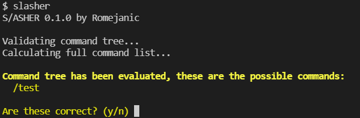
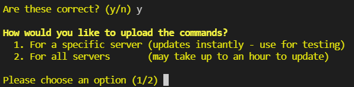
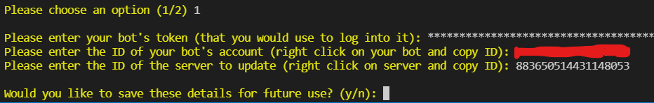
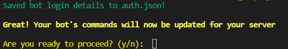
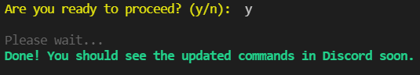
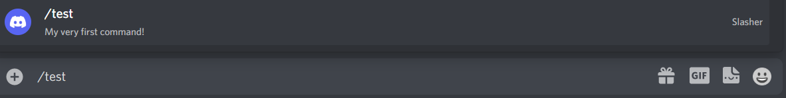
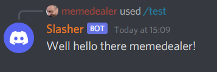

# Getting started

**Table of Contents**
1. [Introduction](#introduction)
2. [Install the package](#install-the-package)
3. [Create your command file](#create-your-command-file)
4. [Run the slasher utility](#run-the-slasher-utility)
5. [Writing your bot](#writing-your-bot)
6. [What's next?](#whats-next)
7. [Common issues/errors](#common-issueserrors)

## Introduction
Welcome! You're on your way to creating your first Discord bot with Slasher!

Let's start with a little bit about what to expect:

* Slasher is mainly two things: a command line tool and a library
* Slasher is an *abstraction layer* which sits on top of discord.js, it is **NOT** a replacement for discord.js
* You should still have a thorough knowledge of discord.js and how to use it. In fact, knowledge of how to use slash commands with vanilla discord.js would be preferable (maybe to increase appreciation for Slasher :P)
* This package is now out of beta and considered stable. If anything goes wrong, please [report it](https://github.com/Romejanic/slasher/issues/new/choose) so this package can become as awesome as possible :D

**You will need**
- [A bot application](https://discord.com/developers/applications)
- A latest [node.js](https://nodejs.org/en/) installation (at least v16)
- A Discord server for testing

**When inviting your bot to your server** make sure it has the `bot` and `applications.commands` scopes, otherwise you won't be able to update the commands! ([see here](img/scopes.png))

Finally we can get into programming!

## Install the package
The first step is always to add the package to your project. This can be done with your package manager of choice. With npm, you type:
```sh
$ npm i -s discord.js discord.js-slasher
```

While Slasher depends on the `discord.js` package I'd still recommend that you add `discord.js` to your dependencies separately, in case (for whatever reason) you decide to stop using Slasher. Slasher also defines `discord.js` as a peer dependency, which means it shouldn't be possible to have a version conflict. If that does happen [please report it](https://github.com/Romejanic/slasher/issues/new/choose).

## Create your command file
With Slasher, all of your commands will be defined in the `commands.json` file in the root directory of your project. Go ahead and create it now.

The first thing you'll want to do is add this template:
```json
{
    "$schema": "https://raw.githubusercontent.com/Romejanic/slasher/master/schema.json"
}
```

The `$schema` property defines the URL of the JSON Schema for this file. With this property present, using an IDE like [Visual Studio Code](https://code.visualstudio.com/) will provide auto-completion and suggestions based on the specification of the `commands.json` file.

To add a command, you just create a new object property in this file with your command's name!
```json
{
    "$schema": "https://raw.githubusercontent.com/Romejanic/slasher/master/schema.json",

    "test": {}
}
```

This will create the `/test` command in Discord! However for this command to be valid, you must add a `description` for the command (which will appear underneath the command in Discord).
```json
{
    "$schema": "https://raw.githubusercontent.com/Romejanic/slasher/master/schema.json",

    "test": {
        "description": "My very first command!"
    }
}
```

You now have everything you need to make your first command!

## Run the slasher utility
Installing the slasher package also adds a new command line tool to your workspace. This utility is responsible for validating the `commands.json` file and then updating the data on Discord's end.

You can run this utility by simply opening a terminal in your project's folder and running:
```sh
$ npx slasher
```

You will see this output in the terminal, with a list of the commands:


Enter `y` to proceed. You will then be asked if you'd like to upload the commands for a specific server or globally.


**For immediate testing** you should choose option 1, as it updates quickly.

**When deploying your bot** you should choose option 2, as it takes a lot longer but updates the commands on all servers.

For now just choose `1` so it updates on your server.

The first time you run the utility you will also be prompted to enter your bot's token, client ID and the server ID you'd like to update. Therefore you will need to copy the IDs from Discord, and the token from your bot's application page ([how do I do this?](https://support.discord.com/hc/en-us/articles/206346498-Where-can-I-find-my-User-Server-Message-ID-)).

After you enter them into Slasher you'll get a prompt to save the details for future use.


**To save time in future,** you should enter `y`. This will create an `auth.json` file in the root of your project, and add an entry for it to your `.gitignore` file.

***!!! IMPORTANT !!!***
If you Git, make sure you **do not** remove the entry from your gitignore file.

If you do not use Git, make sure you **add an entry** to your version control system's ignore file.

### **YOU MUST NEVER, EVER, EVER, EVER, EVER COMMIT THIS FILE TO YOUR REPOSITORY!!!!**

Doing so would make your bot token public!! This means that anyone who stumbles upon your repository can take your token and use it to impersonate your bot. Even if you delete it later, it can still be accessible to them through past commits, forcing you to regenerate it in your developer portal. So do yourself a favour and **NEVER** commit this file. And if you don't use Git, add it to your project's ignore file RIGHT NOW.

Anyway, once you have agreed to this, it will prompt you that your commands will now be updated for the server!


In order to update your commands on Discord, just type `y`! If all is well, you should recieve this prompt!


If you go to Discord and type `/test` into a text channel, you should see your new command! Hooray!


## Writing your bot
Now that we've updated the command on Discord, it's time to actually write the bot which handles the command!

You can also follow along this guide with Typescript if you would prefer to use it. Slasher has full type support for both Javascript and Typescript, so using it with Typescript should be a breeze! In fact, Slasher was actually written in Typescript.

Add an `index.js` file to your project. The first thing to do is to add an import for the project.

In normal Javascript you do it the usual way with `require()`:
```js
const { SlasherClient, SlasherEvents } = require("discord.js-slasher");
```

If you're using an ES6 transpiler or Typescript, you can type this:
```ts
import { SlasherClient, SlasherEvents } from 'discord.js-slasher';
```

You then need to create the client which will handle the events and logging into discord.js.
```js
const client = new SlasherClient();
```

The client constructor takes an argument, which is the [SlasherClientOptions](../api/SlasherClientOptions.md), and it is used to pass the token into the client. However, since we saved our details in the `auth.json` file, the client can actually read from it to get the token automatically!

And that's it! Just an FYI, there is also an option to supply the token directly if you are using a different method to store the bot's token (e.g. custom config file, [dotenv](https://www.npmjs.com/package/dotenv), etc). You can use it like so:
```js
const token  = ...; // token from somewhere
const client = new SlasherClient({ token });
```

However for this guide, you can just stick to the first method with no options.

Next up we need to add an event listener which will respond to our command. This will be fired whenever a user runs one of your bot's commands, and will provide a [context object](../api/CommandContext.md) with a data about the command, it's environment and it's sender.

We can add the event listener like so:
```js
client.on(SlasherEvents.CommandCreate, (ctx) => {

});
```

The first thing is to check which command has been run. In this case we're looking for the `/test` command, so we'll write:
```js
client.on(SlasherEvents.CommandCreate, (ctx) => {
    if(ctx.name === "test") {

    }
});
```

Inside here we can now do whatever we want! But for now, let's write a command which greets the user. We can do this by accessing the `ctx.user` object, which is just an instance of the discord.js class [User](https://discord.js.org/#/docs/main/stable/class/User).

Then we'll just use `ctx.reply()` to send a reply message back to the user.
```js
client.on(SlasherEvents.CommandCreate, (ctx) => {
    if(ctx.name === "test") {
        ctx.reply(`Well hello there ${ctx.user.username}!`);
    }
});
```

That's pretty much it! The last thing left to do which is absolutely necessary is to send the call for the client to log into Discord with the bot token and start handling requests! But I'll also add a listener for the discord.js event `Events.ClientReady` to let us know when the bot is active.

```js
const { Events } = require("discord.js");
// ...

client.on(Events.ClientReady, () => {
    console.log(`Logged in as ${client.user.tag}`);
});

// log into discord with the token in auth.json
client.login();
```

We're all done! We can now try running the bot and testing out our first command!

```sh
$ node index.js
```
After a couple of seconds, you should see it say something like `Logged in as Bot#0000`. At this point you can go back to your Discord server and type `/test` into a text channel. When you hit enter, after a second or so, you should see something like this:



Congratulations! You just made your first Discord bot using Slasher!

## Final code
If you're looking for an overview of the guide or just a starting point for your next bot, here's the complete code for `index.js`:
```js
const { Events } = require("discord.js");
const { SlasherClient, SlasherEvents } = require("discord.js-slasher");
// or with imports
// import { Events } from 'discord.js';
// import { SlasherClient, SlasherEvents } from 'discord.js-slasher';

const client = new SlasherClient();

client.on(SlasherEvents.CommandCreate, (ctx) => {
    if(ctx.name === "test") {
        ctx.reply(`Well hello there ${ctx.user.username}!`);
    }
});

client.on(Events.ClientReady, () => {
    console.log(`Logged in as ${client.user.tag}`);
});

client.login(); // log into discord
```

## What's next?
* Check out the [CommandContext API Reference](../api/CommandContext.md) to see what you can do
* Learn about [adding options](adding-options.md) to your commands
* Learn about [the command.json format](command-json.md)
* Learn about [controlling your command's permissions](command-json.md#permissions)
* Learn to spice up your bot's responses with [MessageEmbeds](https://discordjs.guide/popular-topics/embeds.html)

## Common issues/errors
**Running ```npx slasher```**
```
Error updating commands with Discord!
Please check the following error as it may be an issue with your command tree.

DiscordAPIError[50001]: Missing Access
```
Ensure within the [Discord Developer Portal](https://discord.com/developers/) that `applications.commands` is enabled in both `OAuth2 > General > Scopes` and `OAuth2 > URL Generator > Scopes` when adding the bot to a server.
